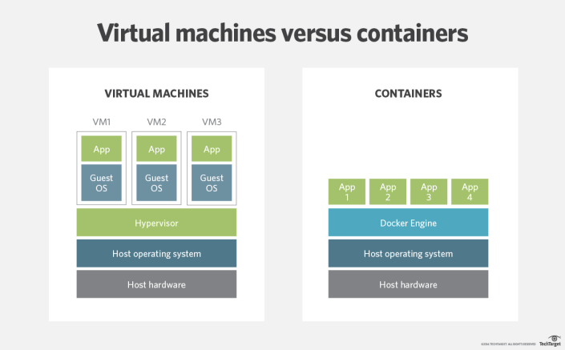

# Docker
- Containerisation - Packaging code together which can be ran from any environment
- Containerisation software is very light weight compared to vagrant, or other software i.e. its Faster!
## What is Docker?

- Docker is an open source platform **DockerHub documentation** 
- Containerisation software - It enables us to separate applications from the infrastructure
- It allows us to deliver software faster! Much more light weight than Vagrant and other software
- Written in **GO** language

[Docker Overview](https://docs.docker.com/get-started/overview/)

## Why Docker over other containerisation software?
- Multi billion dollar companies are using or adapting Docker i.e. Ebay, Netflix, Sky 
- Docker adoption is anticipated by 50% by the end of 2020 
- It allows us to deliver software faster! Much more light weight than Vagrant and other software

## What is the difference between a VM and Docker

- Docker is light weight and user friendly 
- Docker shares the resources of OS as opposed to using the OS completely 
- Docker engine connects the container with OS and only uses the resources required
- VM works with Hypervisor to connect guest OS/VM with Host OS/server

## Docker Commands
- `docker pull <name_of_image>` 
- `docker push <dockerid/docker_repo_name:tagname>` -> Pushes to docker hub repository to make changes available globally
- `docker run <name_of_image> or hello-world` -> To see docker installation running correctly
- `docker build -t <name_of_image>`
- `docker commit <name_of_image/container_id>`  
  
- `docker images` -> To see current images 
- `docker start <name_of_image/container_id>` -> Starts container
- `docker stop <name_of_image/container_id>` -> Stops container
- `docker rm <name_of_image/container_id>` -> Removes container
- `docker ps and ps -a <name_of_image/container_id>` -> to check the existing containers like `ls` !!!
  

- `docker history <image_id>`
- `docker inspect <image_id>`
- `docker logs <container_id>`

## Logging into a running container 
- `docker exec -it <name_of_image/container_id>` -> Go inside the container very similar to `vagrant up and ssh into that vm` -> ***MUCH FASTER*** THAN vagrant 
  - `-it` -> Interactive Shell

- `-d` means detached and `-p` means ports and you specify the ports after, the first being the port be can use to connect from localhost and second is the one docker will use
- `docker run -d -p 80:80 nginx` -> Installs nginx on `localhost:80` in seconds
- `docker run -d -p 2368:2368 ghost` -> Installs ghost on `localhost:2368` in browser

### Making docker docs available on our localhost
- `docker run -d -p 4000:4000 docs/docker.github.io` -> Downloads DockerHub onto `localhost:4000`

- ***Port mapping in containers:***
  - `docker run -d -p localhost-port:container-port <image>`
  - e.g. `docker run -d -p 4001:4000 image` -> It will run on `localhost:4001` NOT `4000` as before

# Hosting a static website inside a container using nginx webserver
### Adding html to nginx IMPORTANT!!!!!
- Create a `index.html` file with some text 
- `docker exec -it <ID of nginx> bash` -> Didnt work on windows Bash
- FIX -> `alias docker="winpty docker"` -> Now just write the same command so you essentially hide winpty behind docker

- Once inside the container in bash:
  - `apt-get update -y`
  - `uname -a` -> Find out name of machine 
  - Path to HTML -> `/usr/share/nginx/html/index.html`

### Copying files into a running container 
**To copy in a `index.html` file into the running container:**
(Make sure to specify the file at the end to overwrite it!)
- `docker cp filepath/filename <container_id>:filepath/filename` 
- e.g.:
- `docker cp index.html 13f11cef9fcd:usr/share/nginx/html/index.html`

### Pushing changes to your Docker Hub repository
- Ensure container is running
- `docker commit <container_id> <user_id>/<repo_name>`
- `docker push <user_id>/<repo_name>`
- Now changes should be visible as `latest` on docker hub
  - You can alternatively add a tag to the end of the commit to name it a specific version of working e.g. `v1`

### Running images FROM DockerHub on your localhost
- Now REMOVE from localhost, only need to pull from our Repos!
  - Remove the created Docker image from `docker images`
  - Run on a desired port any image from the internet
  - `docker run -d -p <localport>:<containerport> <user_id>/<repo_name>`
    - e.g. `docker run -d -p 99:80 matt791/eng74-matt-docker`

### Connect DockerHub to GitHub by navigating to the Account Settings
***- Helps us create webhooks V. USEFUL with Jenkins***

## Logs
- `docker exec -it <ID of nginx> bash`
  - cd /var/log/nginx

- To save logs in a file on localhost:
  - `docker logs <container_id> >> nginx_logs.txt`

## Creating a Docker image
- To build a docker image we need to create a Dockerfile (Naming convention Dockerfile)
  - Why? - To automate the tasks in an image/container
  - What information is required inside the Dockerfile
  - It depends on the clients requirements
  - We need to know the dependencies to run the app/db
  - We need to wrap up all the dependencies in our Dockerfile and instruct the execution command 

- To build an image!!
  - `docker build -t <user_id>/<New_repo_name> .` -> `.` to run the command
## Syntax for Dockerfile
- `FROM` -> User to tell docker which base image to use to build our `nginx as base image` 
- `LABEL MAINTAINER=msokol@spartaglobal.com`
- `COPY` -> files/folders from localhost to the container/image 
- `EXPOSE` -> Default port
- `CMD` -> The execution command  e.g. `["nginx", "-g", "daemon off;"]`

# Microservices Architecture
- **Microservices** are small loosely coupled services that each serve a singular function and communicate together to collectively build an application. Each service is flexible, robust, composable and complete. They run as autonomous processes and communicate with one another through APIs. Each microservice can be implemented in a different programming language on a different platform. Almost any infrastructure can run in a container which holds services encapsulated for operation. Since these containers can be operated in parallel, the existing infrastructure is easier to maintain.

- **Monolith** -> Code’s components are designed to work together, as one cohesive unit, sharing the same memory space. The software built using a monolith approach is self-contained; its components are interconnected and interdependent. If developers want to make any changes or updates to a monolith system, they need to build and deploy the entire stack at once. It’s the same thing with scalability: the entire system, not just the modules in it, is scaled together. With the monolithic architecture it can be difficult to adopt a new technology stack, and in case you want to use a new platform or framework, you’ll have to rewrite the entire solution.

**Benefits of Microservices**
1. Easier to build and maintain apps -> Applications become easier to build and maintain when they’re split into a set of smaller, composable fragments. Managing the code also becomes less painful because each microservice is, in fact, a separate chunk of code
2. Flexibility in tech and scalability
3. Improved Productivity and Speed
4. Autonomous, Cross-functional Teams -> Microservices grant the developers more independence to work autonomously and make technical decisions quickly in smaller groups

**When would you not use microservices?**
- Small projects that do not require or can afford large amounts of resources as that increases cost and complicates programs
  - e.g. Fast food shop wants a website, too costly to use microservices so just simply use a monolith structure
